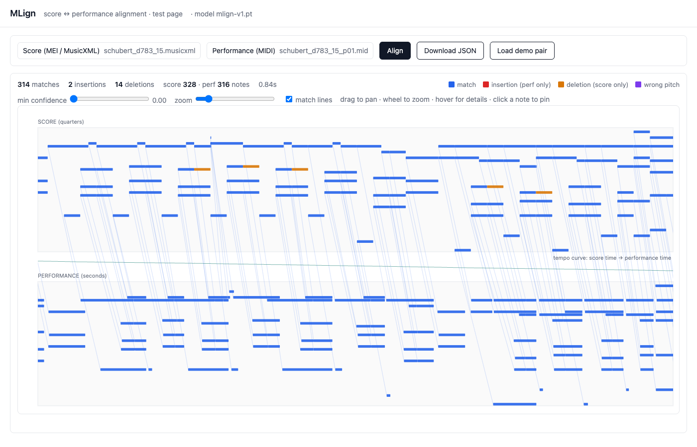

# MLign

Symbolic score→performance alignment: an MEI or MusicXML score plus a MIDI
performance in, a note-level alignment out — every score note matched to a
performed note or marked as not played, every performed note matched or marked
as extra, each decision with a confidence. Learned end-to-end; trained largely
on synthetic expressive performances with exact ground truth.

On the held-out nASAP test split (84 performances the model never saw in any
form) MLign v1 reaches **0.9878** match-F against **0.9852** for DualDTW,
the strongest published system, winning 65 of 84 performances (p < 10⁻⁷) and
scoring best on insertions and deletions as well. Full tables and protocols:
[`docs/RESULTS.md`](docs/RESULTS.md).

## Standing on shoulders

Nothing here starts from zero. The problem, the datasets, the metric and the
baselines all come from the community that built symbolic alignment into a
measurable field:

- **Silvan Peter, Carlos Cancino-Chacón, Francesco Foscarin, Andrew McLeod,
  Florian Henkel, Emmanouil Karystinaios and Gerhard Widmer** produced the
  note-level ASAP alignments and the evaluation protocol we adopt unchanged
  (*Automatic Note-Level Score-to-Performance Alignments in the ASAP Dataset*,
  TISMIR 2023), and ship the reference systems in
  [parangonar](https://github.com/sildater/parangonar) — DualDTW (Peter, ISMIR
  2023) is the bar we measure against, and its two-phase design (a robust
  monotone time map first, per-pitch note assignment second) is one we kept.
- **Peter & Widmer**'s [TheGlueNote](https://github.com/sildater/thegluenote)
  (ISMIR 2024) showed that a transformer can learn note matching from
  self-supervised corruptions of raw MIDI, and introduced the dustbin
  formulation for insertions and deletions. Our self-supervised data source is
  a port of their `reorder()` augmentation.
- **Eita Nakamura, Kazuyoshi Yoshii and Haruhiro Katayose**'s HMM aligner
  (ISMIR 2017) remains the standing classical baseline and the source of the
  heavy-tailed timing model and skip transitions that structured decoding
  still needs.
- **Peter, Hu & Widmer**, *How to Infer Repeat Structures in MIDI Performances*
  (2025): the idea that repeat structure is best solved as preprocessing —
  rank candidate unfoldings, then align — is theirs; we reimplement it.
- Datasets: **ASAP** (Foscarin, McLeod, Rigaux, Jacquemard, Sakai, ISMIR 2020),
  the **Vienna 4x22 Piano Corpus** (Werner Goebl, 1999) and
  **Batik-plays-Mozart** (Patricia Hu & Gerhard Widmer, ISMIR 2023).
- From computer vision: the per-point matchability head of **LightGlue**
  (Lindenberger, Sarlin, Pollefeys, ICCV 2023) replaces a single learned
  dustbin token.

## What we do differently

1. **Exact synthetic supervision instead of mechanical corruption.**
   Performances are rendered from scores by
   [espressivo](https://github.com/pfefferniels/espressivo) (the TypeScript
   port of meico) with MPM performance instructions — rubato, asynchrony,
   articulation, dynamics, arpeggios, generated ornaments (trills, mordents,
   turns), a parametric expressivity curriculum — and each rendered note carries
   the score note's `xml:id`. On top sits a performer-error layer (wrong notes,
   slips, restarts, skipped passages) that logs its edits as ground truth. This
   is supervision no corruption of MIDI can produce: musically plausible
   expression with perfect labels, including one-to-many ornament realizations.
2. **Real music decides which checkpoint ships.** Training mixes ~47 % real
   material (self-supervised windows and real ground-truth windows from the
   nASAP training pieces) with the synthetic corpus, and — the single most
   consequential choice — checkpoints are selected on a real-music validation
   loss. Selection on the mixed synthetic validation set picks a checkpoint
   seven epochs too late; a popular dev benchmark picks one that loses on the
   test set. `docs/RESULTS.md` §5 shows the divergence measured in-run.
3. **MEI-native, richer output.** Scores enter as MEI (via espressivo) so
   alignments land directly on the edition's `xml:id`s; output records carry
   confidence and can express wrong-pitch matches, and there is an export to
   MEI's own performance module (`<performance>/<recording>/<when>`).
4. **Repeats from symbols alone.** With the score folded to a single pass,
   MLign infers the played structure and aligns at 0.996 match-F on the Vienna
   4x22 repeat pieces — a condition where published symbolic systems score
   below 0.37 (RUMAA, WASPAA 2025, Table 2; RUMAA itself reaches 98.4 pooled
   F from audio).

The model is small: 1.5 M parameters, four transformer layers over a single
stream of score and performance note tokens with relative positions, a
bilinear match head and per-note matchability. Decoding fuses a cluster-level
DTW over pitch-set and model-confidence cost with the model's mutual anchors
into a monotone time map, then assigns notes per pitch. Details:
[`docs/DESIGN.md`](docs/DESIGN.md).

## Use

```bash
# align (json | match | jsonl output); the released model is the default
PYTHONPATH=src python -m mlign.cli align score.mei performance.mid --format match -o out.match

# interactive test page at http://127.0.0.1:8765/
PYTHONPATH=src python -m mlign.serve
```



MusicXML input and the released model need only `torch`, `numpy` and
`partitura`. MEI input needs a built espressivo (path in `src/mlign/cli.py`).
Benchmarks (`eval/`) expect the ASAP, Vienna 4x22 and Batik datasets under
`data/benchmarks/` and TheGlueNote's preprocessed 4x22 `.npz` files.

## Layout

`src/mlign/` model, inference, CLI, server, MEI export, repeat inference ·
`src/robustness/` performer-error layer with edit-log ground truth ·
`scripts/corpus/` corpus generators (espressivo renders, self-supervised
windows, real-GT windows) · `scripts/train.py` trainer · `eval/` benchmark
harnesses and metrics · `slurm/` cluster job script · `models/mlign-v1.pt`
the released model (= training run v5real, epoch 21).

MIT. Built with the espressivo, mpmify and bwUniCluster teams; see
`docs/RESULTS.md` for every number and how it was obtained.
